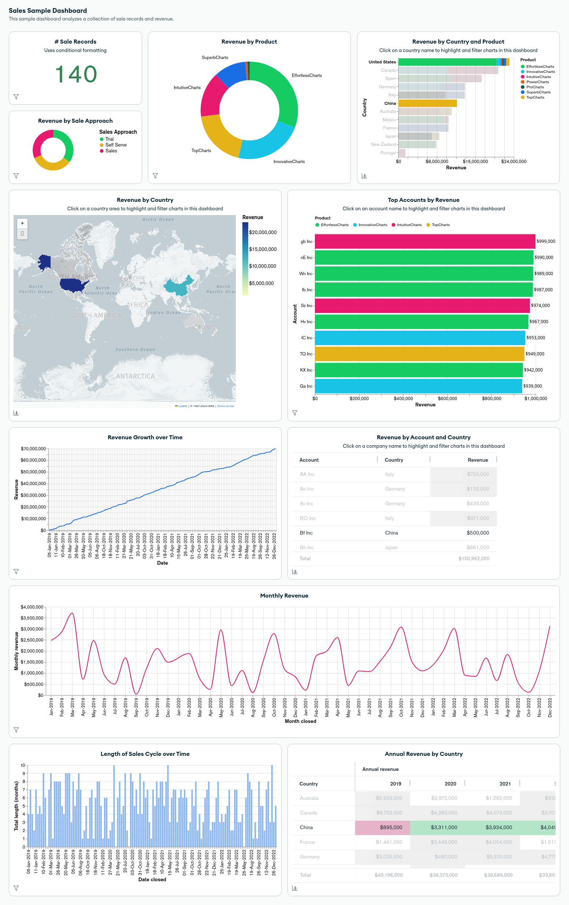

| Label | Discription | links |
| :- | :- | :-: |
| *ISSUE* : | 001, MERN STACK PROJECT | - |
| *TOPIC* : | Ecommerce Web Application | :paperclip: [open](/) |
| *AUTHOR* : | Arpit Tiwari | :paperclip: [Profile](https://portfolio.arpit.netlify.com) |
| *DESIGNATION* : | Full Stack Javascript Web Developer | - |

---

# :shopping: Full Stack e-Commerce Project
([Go to app:paperclip:](https://ecommerce-application-by-arpit.vercel.app))

This is a standard E-Commerce project I am designing from scratch as a MERN STACK developer. Through this Project I will showcase how an actual ECOMMERCE-WEB APPLICATION is built along with the architecture of the Web Applications, highlighting the complex understanding of the environment we are working on with the detailed concepts used in this project. I will keep updating this project for better functions and UI/UX, better functionalities including most of what can be embedded into one Full Stack Project.

## :point_right: MERN STACK :

Well then, What is a MERN Stack..? The MERN stack is a popular technology stack used for building _web applications_. It is an 'acronym' that represents a set of technologies:

- `MongoDB` : A *NoSQL* database that stores data in a flexible, *JSON*-like format called *BSON* (Binary JSON). MongoDB is known for its *scalability, flexibility, and ease of integration with web applications*.

- `Express.js` : A *back-end web application framework* for Node.js. "Express.js simplifies the process of building robust and scalable web applications" by providing a set of features for *routing, middleware, and handling HTTP requests and responses*.

- `React.js` : A *JavaScript library* for building user interfaces. React is maintained by Facebook and is widely used for creating *dynamic and interactive front-end components*. It allows developers to build reusable UI components that update efficiently based on changes in the application state.

- `Node.js` : A *JavaScript runtime environment that executes server-side code*. Node.js is built on the V8 JavaScript engine and enables developers to use JavaScript for both server-side and client-side development, creating a more unified development experience.

When combined, these technologies form the **MERN stack**, which covers the full development cycle of a web application—from database management to server-side scripting, API development, and front-end development. Here's a brief overview of each component in the MERN stack:

1. **Front-end (Client-Side)**:   
    - **ReactJS**: Manages the user interface and facilitates the creation of interactive components.

2. **Back-end (Server-Side)**:   
    - **NodeJS**: Executes server-side JavaScript code and handles server logic.   
    - **ExpressJS**: A web application framework for Node.js, simplifying the development of server-side applications.

3. **Database**:   
    - **MongoDB**: A NoSQL database that stores data in a flexible, JSON-like format. It is often used to store and retrieve data for web applications.

:paperclip: The MERN stack provides a cohesive and streamlined development experience for building modern, scalable, and efficient web applications. It is widely adopted by developers and organizations for its flexibility, performance, and the ability to use JavaScript across the entire development stack.

## :point_right: Frontend Catalog Only :
In the frontend of the project I added a catalog where the user can see the products fetched from external. The product cards with limited details based on first-response-importance, without making any additional requests to the backend. When the user adds the item to cart triggering a request to backend with neccessary information, which then associates the product to the users cart updating the database accordingly. 

- With this, my frontend doesn't need - to fetch the entire catalog each time a product information is required or to fire an api-request to fetch the data for the required product info.
- It minimizes the data-tranfer between frontend and backend.
- Users can get quick access to the product info without additional load from the backend.
- Reduces the load on the frontend speeding up the UX. Contributing to smooth and responsive UX

## :bookmark: Roadmap for the Project : 

- [x]  **PROJECT ARCHITECTURE** : with Frontend in `JavaScript` , `React` , `ReactRouter` , `CSS` , `TailwindCSS` & Backend with `NodeJS` , `Express`
- [x]  **AXIOS** : For the communication between the frontend and the backend of the project
- [x]  **NODEMON**
- [x]  **DATABASE** : `MongoDB` as my first choics for database but I will for sure use `mySQL` in the next Project. `http` methods, pushing data to the database, store/manage/create/remove data, to communicate to DB used `mongoose`
- [x]  **REST API** : API handeling and data management in the frontend and backend
- [x]  **AUTHORIZATION & AUTHENTICATION** : User and Admin routes, User Management, using `JWT` and `bryptJS`, hashing and encryption used
- [x]  **USER & PRODUCT MANAGEMENT** : Cart Management, Orders Management, Product Handeling
- [x]  **PAYEMENT GATEWAY** : RazorPay Gateway for the payement.
- [x]  **HOSTING** :
- [x]  **SERVER DEPLOYMENT** :
- [x]  **TESTING, CODE FORMATTING** :
- [ ]  **VERSION CONTROL, CODE MANAGEMENT & CONTINUOUS INTEGRATION** :

### Stage Two: Further Improvising
- Use of `MySQL DB`
- Github Management
- New seller route to be added to the app
- Automation in testing
- API Documentation
- Error Monitoring & Debugging
- Web Performance Analytics

<!-- #### REFERENCES  -->
<!-- 
<a href="https://iconscout.com/illustrations/goods" class="text-underline font-size-sm" target="_blank">Goods delivery trucks send packages purchased online using apps and paid by credit card</a> by <a href="https://iconscout.com/contributors/imam-naki" class="text-underline font-size-sm">Imamfathoni0</a> on <a href="https://iconscout.com" class="text-underline font-size-sm">IconScout</a> 
<a href="https://iconscout.com/illustrations/buy" class="text-underline font-size-sm" target="_blank">Buy photography gear online</a> by <a href="https://iconscout.com/contributors/posse-studio" class="text-underline font-size-sm" target="_blank">Studio Posse</a>

<a href="https://iconscout.com/illustrations/shopping-day" class="text-underline font-size-sm" target="_blank">Shopping day</a> by <a href="https://iconscout.com/contributors/Aleshaku" class="text-underline font-size-sm">Ilusiku Studio</a> on <a href="https://iconscout.com" class="text-underline font-size-sm">IconScout</a>
-->

<!-- export HTTPS=true&&SSL_CRT_FILE=...certificate/cert.pem && SSL_KEY_FILE=.../certificate/key.pem  -->